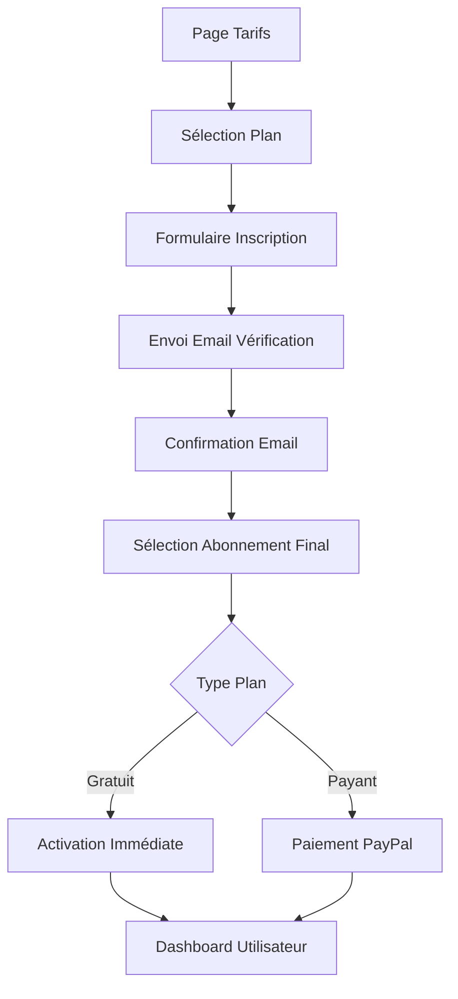
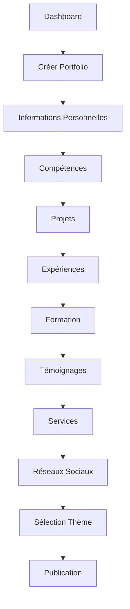

# QuickFolio - Plateforme SaaS de Création de Portfolios Professionnels

## 📋 Table des Matières
1. [Vue d'ensemble de la plateforme](#vue-densemble)
2. [Architecture technique](#architecture-technique)
3. [Processus utilisateur](#processus-utilisateur)
4. [Interfaces principales](#interfaces-principales)
5. [Fonctionnalités administrateur](#fonctionnalités-administrateur)
6. [Technologies utilisées](#technologies-utilisées)

---

## 🎯 Vue d'ensemble de la plateforme {#vue-densemble}

**QuickFolio** est une plateforme SaaS (Software as a Service) innovante conçue pour simplifier la création de portfolios professionnels en ligne. Elle permet aux utilisateurs de créer, personnaliser et publier leur portfolio sans compétences techniques préalables.

### Objectifs principaux :
- **Simplicité** : Interface intuitive pour tous les niveaux d'utilisateurs
- **Professionnalisme** : Templates modernes et designs responsives
- **Accessibilité** : Solution abordable avec essai gratuit de 3 jours
- **Flexibilité** : Personnalisation complète du contenu et du design

---

## 🏗️ Architecture technique {#architecture-technique}

### Stack technologique :
- **Frontend** : Angular 19 avec architecture standalone
- **UI Framework** : PrimeNG avec thème Aura
- **Styling** : CSS personnalisé avec variables globales
- **Paiements** : Intégration PayPal
- **Authentification** : Système de rôles (Admin/User)
- **Responsive Design** : Adaptation mobile-first

### Architecture modulaire :
```
src/app/
├── core/                    # Services et modèles centraux
│   ├── guards/             # Protection des routes
│   ├── models/             # Interfaces TypeScript
│   └── services/           # Services métier
├── features/               # Modules fonctionnels
│   ├── auth/              # Authentification
│   ├── admin/             # Interface administrateur
│   ├── user/              # Interface utilisateur
│   └── shared/            # Composants partagés
└── assets/                # Ressources statiques
```

---

## 🔄 Processus utilisateur {#processus-utilisateur}

### 1. Processus d'inscription complet



**Description du processus :**
1. **Découverte** : L'utilisateur consulte les tarifs et sélectionne un plan
2. **Inscription** : Saisie des informations personnelles (nom, prénom, email, etc.)
3. **Vérification** : Envoi automatique d'un email de confirmation
4. **Validation** : L'utilisateur confirme son email via le lien reçu
5. **Abonnement** : Choix final du plan et paiement si nécessaire
6. **Activation** : Accès immédiat au dashboard et aux fonctionnalités

### 2. Processus de création de portfolio



---

## 🖥️ Interfaces principales {#interfaces-principales}

### 1. Page d'accueil
**Objectif** : Présenter la plateforme et convertir les visiteurs

**Éléments clés :**
- Hero section avec proposition de valeur claire
- Fonctionnalités principales en grille
- Témoignages clients authentiques
- Call-to-action vers l'inscription gratuite
- Design moderne avec animations subtiles

**Capture d'écran suggérée :** *Interface d'accueil avec hero section et fonctionnalités*

### 2. Page de tarification
**Objectif** : Présenter les plans d'abonnement de manière claire

**Fonctionnalités :**
- 3 plans : Essai gratuit (3 jours), Mensuel (69 MAD), Annuel (690 MAD)
- Comparaison des fonctionnalités
- Badge "Recommandé" sur l'essai gratuit
- Intégration PayPal pour les paiements
- FAQ pour répondre aux questions courantes

**Capture d'écran suggérée :** *Grille des plans avec boutons PayPal*

### 3. Dashboard utilisateur
**Objectif** : Centre de contrôle pour la gestion du portfolio

**Fonctionnalités principales :**
- Vue d'ensemble du portfolio actuel
- Statistiques de performance (vues, contacts)
- Actions rapides (créer, modifier, publier)
- Gestion du statut (actif, brouillon, archivé)
- Contrôle de la visibilité (public/privé)
- Informations d'abonnement avec jours restants

**Capture d'écran suggérée :** *Dashboard avec tableau de gestion du portfolio*

### 4. Portfolio Builder
**Objectif** : Interface de création et modification du portfolio

**Architecture en onglets :**
- **Informations personnelles** : Données de base, photos, statistiques
- **Compétences** : Gestion avec niveaux en pourcentage (1-100%)
- **Projets** : Réalisations avec images et technologies
- **Expériences** : Parcours professionnel
- **Formation** : Diplômes et certifications
- **Témoignages** : Avis clients avec système d'étoiles
- **Services** : Prestations proposées avec icônes
- **Réseaux sociaux** : Liens vers profils externes
- **Types personnalisés** : Gestion des catégories

**Capture d'écran suggérée :** *Interface du builder avec navigation par onglets*

### 5. Gestion des compétences
**Innovation** : Système de niveaux en pourcentage avec barre de progression

**Fonctionnalités :**
- Slider de 1% à 100% pour définir le niveau
- Catégorisation par types (Technique, Soft Skills, Langues)
- Affichage visuel avec ProgressBar
- Labels automatiques : Débutant, Intermédiaire, Avancé, Expert

**Capture d'écran suggérée :** *Interface de gestion des compétences avec sliders*

---

## 👨‍💼 Fonctionnalités administrateur {#fonctionnalités-administrateur}

### 1. Dashboard administrateur
**Objectif** : Vue d'ensemble de la plateforme

**Métriques clés :**
- Nombre total d'utilisateurs
- Abonnements actifs
- Revenus générés
- Portfolios créés
- Graphiques d'évolution des revenus
- Activité récente en temps réel

**Capture d'écran suggérée :** *Dashboard admin avec statistiques et graphiques*

### 2. Gestion des utilisateurs
**Fonctionnalités :**
- Liste complète des utilisateurs inscrits
- Recherche et filtrage avancés
- Actions : Activer, désactiver, suspendre, supprimer
- Détails complets de chaque utilisateur
- Gestion des abonnements utilisateur

**Capture d'écran suggérée :** *Interface de gestion des utilisateurs avec actions*

### 3. Gestion des plans d'abonnement
**Fonctionnalités :**
- CRUD complet des plans
- Configuration des prix et durées
- Gestion des avantages par plan
- Marquage des plans populaires
- Statistiques d'utilisation

### 4. Gestion des thèmes
**Fonctionnalités :**
- Upload d'images d'aperçu
- Activation/désactivation des thèmes
- Statistiques d'utilisation
- Gestion des thèmes premium

### 5. Gestion des réseaux sociaux
**Nouvelle fonctionnalité :**
- Configuration des réseaux disponibles
- Gestion des icônes et URLs de base
- Activation/désactivation par réseau
- Interface d'administration dédiée

---

## 🛠️ Technologies utilisées {#technologies-utilisées}

### Frontend
- **Angular 19** : Framework principal avec architecture standalone
- **TypeScript** : Typage statique pour la robustesse
- **PrimeNG** : Composants UI professionnels
- **RxJS** : Programmation réactive
- **CSS3** : Styling moderne avec variables CSS

### Intégrations
- **PayPal SDK** : Gestion des paiements sécurisés
- **File Upload** : Gestion des images et documents
- **Responsive Design** : Adaptation tous écrans

### Architecture
- **Lazy Loading** : Chargement optimisé des modules
- **Guards** : Protection des routes par rôles
- **Services** : Logique métier centralisée
- **Reactive Forms** : Validation robuste des formulaires

---

## 📊 Métriques et Performance

### Objectifs de performance :
- **Temps de chargement** : < 3 secondes
- **Responsive** : Support mobile complet
- **Accessibilité** : Conformité WCAG 2.1
- **SEO** : Optimisation pour les moteurs de recherche

### Indicateurs de succès :
- **Taux de conversion** : Visiteurs → Utilisateurs inscrits
- **Rétention** : Utilisateurs actifs mensuels
- **Satisfaction** : Score NPS des utilisateurs
- **Performance technique** : Temps de réponse et disponibilité

---

## 🚀 Perspectives d'évolution

### Fonctionnalités futures :
- **Templates supplémentaires** : Nouveaux designs de portfolio
- **Analytics avancés** : Statistiques détaillées des portfolios
- **Intégrations** : LinkedIn, GitHub, Behance
- **Collaboration** : Partage et feedback sur les portfolios
- **Mobile App** : Application native iOS/Android

Cette plateforme représente une solution complète et moderne pour la création de portfolios professionnels, alliant simplicité d'utilisation et puissance fonctionnelle.